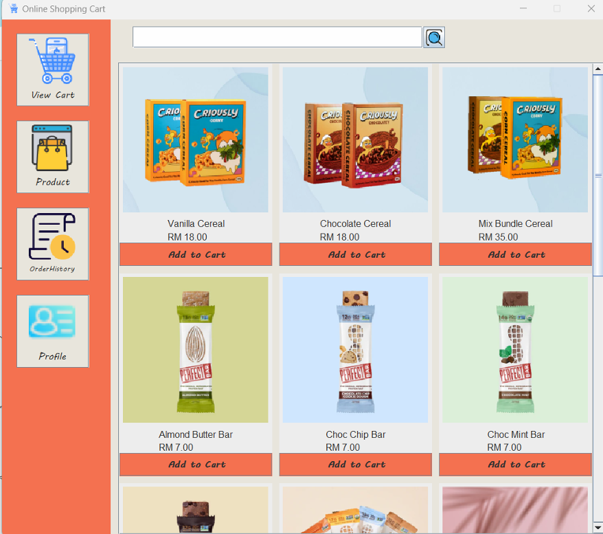
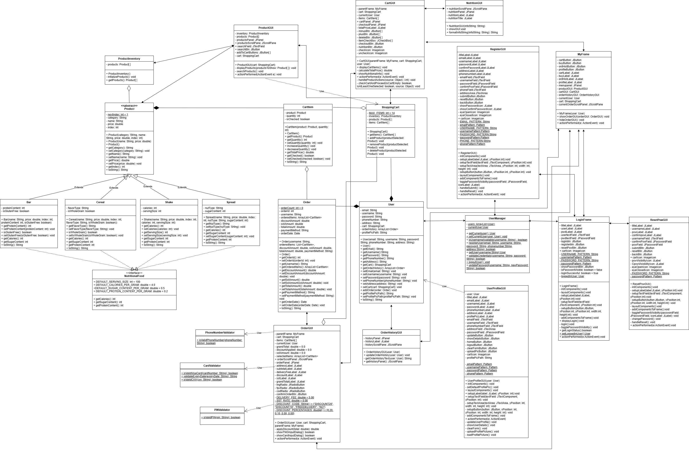

# Java Online Shopping Cart System

A Java Swing based Online Shopping Cart System developed for the BACS2023 Object-Oriented Programming assignment.

## Project Overview

This project is designed as an online shopping cart system that applies object-oriented programming principles in Java. The system allows users to register, log in, browse products, manage a shopping cart, proceed to checkout, and review order history.

The project includes four main modules:
- User Management Module
- Cart Management Module
- Product Management Module
- Order Processing Module

It also includes extra features such as:
- Promotion and discount code support
- Nutritional information display
- User profile management


## Features

### User Management
- User registration
- User login
- Password reset
- Input validation
- Password visibility toggle
- User profile update
- Upload profile image

### Product Management
- Browse available products
- Search products by name
- Add products to cart

### Cart Management
- View cart items
- Increase or decrease quantity
- Delete items from cart
- Select items for checkout
- Calculate total price
- View nutritional information

### Order Processing
- Checkout selected items
- Payment method selection
- Discount code handling
- Order placement
- Order history display

### UML Diagram


## Technologies Used
- Java
- Java Swing
- Object-Oriented Programming concepts

## Project Structure

```text
src/
└── assignment/
    ├── Assignment.java
    ├── LoginFrame.java
    ├── RegisterGUI.java
    ├── ResetPswGUI.java
    ├── User.java
    ├── UserManager.java
    ├── UserProfileGUI.java
    ├── Product.java
    ├── ProductGUI.java
    ├── ProductInventory.java
    ├── CartItem.java
    ├── ShoppingCart.java
    ├── CartGUI.java
    ├── Order.java
    ├── OrderGUI.java
    ├── OrderHistoryGUI.java
    ├── NutritionalFood.java
    ├── Bar.java
    ├── Cereal.java
    ├── Shake.java
    └── Spread.java
